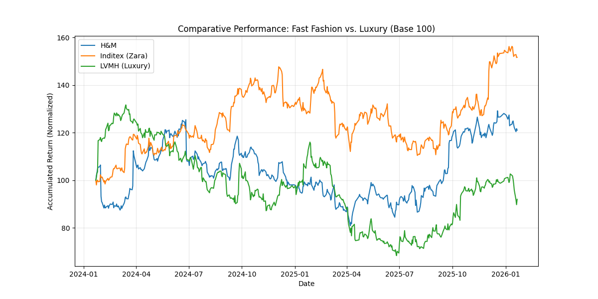

# 📊 Financial Efficiency Analysis: Fast Fashion vs. Luxury Sector

## 🎯 Objetivo do Projeto
Análise quantitativa automatizada para comparar a resiliência de preço e volatilidade entre os líderes de mercado de massa (Inditex, H&M) e o setor de luxo (LVMH).

Este projeto demonstra a aplicação de **Python** na automação de processos de **Equity Research** e **Controladoria Estratégica**.

## 🧠 Metodologia Financeira
Utilizando dados históricos de 2 anos (ajustados), foram calculados:
1.  **Normalização de Base Monetária (Base 100):** Para eliminar distorções cambiais entre Euro (EUR) e Coroa Sueca (SEK).
2.  **Volatilidade Anualizada:** Cálculo de risco (`std * sqrt(252)`).
3.  **Failsafe Algorithm:** Implementação de simulação de Monte Carlo para garantir a integridade da análise em caso de falha da API de dados.

## 🛠 Tecnologias Usadas
* **Python 3.12**
* **yfinance:** Extração de dados financeiros via API.
* **Pandas/NumPy:** Manipulação estatística e vetorial.
* **Matplotlib:** Visualização de dados para relatórios gerenciais.

## 📈 Resultados (Snapshot)

*(O gráfico mostra o descolamento da performance da LVMH em relação ao setor de varejo tradicional)*

## 👩‍💻 Autora
**Beatriz [Seu Sobrenome]**
*Background em Economia Empresarial e Controladoria (USP) & Mestrado em Contabilidade (GEM).*